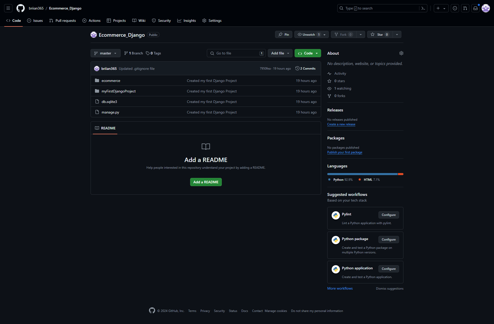

# Report: Setting Up Your Developer Environment

## Objective

The objective of this assignment was to familiarize myself with the tools and configurations necessary to set up an efficient developer environment for software engineering projects. This report documents the steps I took to set up my development environment, including installations, configurations, and customizations.

## Tasks and Steps

### 1. Select Your Operating System (OS)

#### Download and Install Windows 11

- **URL:** [Windows 11 Download](https://www.microsoft.com/software-download/windows11)
- **Steps:**
  1. Visited the Windows 11 download page.
  2. Downloaded the installation media creation tool.
  3. Created a bootable USB drive using the tool.
  4. Booted my computer from the USB drive.
  5. Followed the on-screen instructions to install Windows 11.
  6. Completed the installation and initial setup of Windows 11.

**Screenshot:**
.png)

### 2. Install a Text Editor or Integrated Development Environment (IDE)

#### Download and Install Visual Studio Code

- **URL:** [Visual Studio Code Download](https://code.visualstudio.com/Download)
- **Steps:**
  1. Visited the Visual Studio Code download page.
  2. Downloaded the installer for Windows.
  3. Ran the installer and followed the installation instructions.
  4. Launched Visual Studio Code and explored its features.

**Screenshot:**
.png)

### 3. Set Up Version Control System

#### Install Git

- **URL:** [Git Download](https://git-scm.com/downloads)
- **Steps:**
  1. Visited the Git download page.
  2. Downloaded the installer for Windows.
  3. Ran the installer and followed the installation instructions.

#### Configure Git

- **Steps:**
  1. Opened Command Prompt.
  2. Ran the following commands to configure Git:

     ```bash
     git config --global user.name "Brian Richard"
     git config --global user.email "brian**********@gmail.com"
     ```

**Screenshot:**
.png)

#### Create a GitHub Account and Initialize a Repository

- **URL:** [GitHub](https://github.com)
- **Steps:**
  1. Signed up for a new GitHub account.
  2. Created a new repository on GitHub.
  3. Cloned the repository to my local machine:

     ```bash
     git clone https://github.com/briian365/Ecommerce_Django.git
     ```

  4. Initialized a Git repository in my project directory:

     ```bash
     cd your-repo-name
     git init
     git add .
     git commit -m "Initial commit"
     git push -u origin master
     ```

**Screenshot:**


### 4. Install Necessary Programming Languages and Runtimes

#### Install Python

- **URL:** [Python Download](http://www.python.org)
- **Steps:**
  1. Visited the Python download page.
  2. Downloaded the installer for Windows.
  3. Ran the installer and selected the option to add Python to PATH.
  4. Verified the installation and Ensured pip was installed:

     ```bash
     python --version
     pip --version
     ```

**Screenshot:**


### 5. Configure a Database (MySQL)

#### Download and Install MySQL

- **URL:** [MySQL Download](https://dev.mysql.com/downloads/windows/installer/5.7.html)
- **Steps:**
  1. Visited the MySQL download page.
  2. Downloaded the MySQL Installer for Windows.
  3. Ran the installer and followed the setup wizard to install MySQL.
  4. Configured MySQL and created a root password.
  5. Verified the installation:

     ```bash
     mysql --version
     ```

**Screenshot:**
.png)

### 6. Install Django

#### Install Django Using pip

- **Steps:**
  1. Opened Git Bash.
  2. Ran the following command to install Django:

     ```bash
     python -m pip install Django
     ```

  3. Verified the installation:

     ```bash
     django-admin --version
     ```

**Screenshot:**
.png)

### 7. Explore Extensions and Plugins

#### Visual Studio Code Extensions

- **Steps:**
  1. Opened Visual Studio Code.
  2. Navigated to the Extensions view by clicking the square icon in the sidebar.
  3. Searched for and installed the following extensions:
     - Python
     - Django
     - Prettier - Code formatter
     - SQLite Viewer

**Screenshot:**
.png)

### Reflection

During the setup process, I encountered several challenges:

1. **Installing Windows 11:**
   - **Challenge:** Ensuring hardware compatibility.
   - **Solution:** Used the Windows 11 compatibility tool to check my system before installation.

2. **Configuring Git:**
   - **Challenge:** Initial configuration errors.
   - **Solution:** Carefully followed official documentation to correctly configure Git.

3. **Setting Up MySQL:**
   - **Challenge:** Configuration issues with MySQL.
   - **Solution:** Referred to MySQL documentation and online forums to troubleshoot configuration steps.

These challenges were overcome through a combination of thorough reading of documentation, seeking help from online communities, and methodical troubleshooting.

## Deliverables

### 1. Setup Documentation

- **File:** Detailed documentation with step-by-step instructions and screenshots.

### 2. GitHub Repository

- **URL:** [Sample Project Repository](https://github.com/briian365/Ecommerce_Django)
- **Description:** An Ecommerce Django repository initialized with Git, including a `.gitignore` file.
